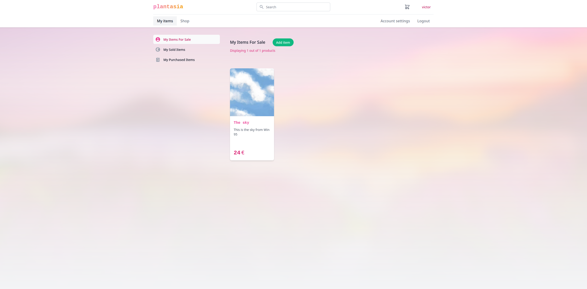

# Web technologies

## How to run the application stack

```bash
# This will start the frontend and backend in a single container
docker compose up
```

Navigate to [http://localhost:8000](http://localhost:8000) in your browser. Navigate to the shop.

Login with the following credentials:

```text
Username: testuser1
Password: pass1
```

---

## DEPRECATED MANUAL SETUP
####  (Broken due to Node.js version mismatch)
```bash
# THIS IS NOW ALL HANDELD BY DOCKER COMPOSE !!!

# From the git repository root dir:

# Create a python venv
# Backend
python -m venv plantasia-env

source plantasia-env/bin/activate

python -m ensurepip --upgrade

python -m pip install -r requirements.txt

python webshop/manage.py migrate


# Frontend
cd webshop/webshop-frontend

npm install

npm run build

# From the git repository root dir
# Start the Django backend which is serving the compiled frontend
python webshop/manage.py runserver --pythonpath=webshop --settings="webshop.settings"
```

## Requirements implemented

---

### **Functional Requirements**

| pts | req nr. | req title                     | done               |
| --- | ------- | ----------------------------- | ------------------ |
| 4p  | 1       | Site architecture (MANDATORY) | :heavy_check_mark: |
| 3p  | 2       | Browse (MANDATORY)            | :heavy_check_mark: |
| 2p  | 3       | Create account (MANDATORY)    | :heavy_check_mark: |
| 2p  | 4       | Login (MANDATORY)             | :heavy_check_mark: |
| 2p  | 5       | Add item (MANDATORY)          | :heavy_check_mark: |
| 3p  | 6       | Add to cart (MANDATORY)       | :heavy_check_mark: |
| 1p  | 7       | Remove from cart (MANDATORY)  | :heavy_check_mark: |
| 6p  | 8       | Pay (MANDATORY)               | :heavy_check_mark: |
| 2p  | 9       | Automatic DB population       | :heavy_check_mark: |
| 3p  | 10      | Search                        | partly done        |
| 3p  | 11      | Routing                       | :heavy_check_mark: |
| 1p  | 12      | Edit Account                  | :heavy_check_mark: |
| 3p  | 13      | Display inventory             | :heavy_check_mark: |
| 2p  | 14      | Edit item                     | :heavy_check_mark: |

### **Non-Functional Requirements**

| pts | req nr. | req title  | done               |
| --- | ------- | ---------- | ------------------ |
| 1p  | 15      | Responsive | :heavy_check_mark: |
| 2p  | 16      | Security   | :heavy_check_mark: |
| 1p  | 17      | Usability  | :heavy_check_mark: |

### **Technical Requirements**

| pts | req nr. | req title            | done               |
| --- | ------- | -------------------- | ------------------ |
| 0p  | 18      | Backend (Mandatory)  | :heavy_check_mark: |
| 0p  | 19      | Frontend (MANDATORY) | :heavy_check_mark: |
| 0p  | 20      | Browser (MANDATORY)  | :heavy_check_mark: |
| 0p  | 21      | Project folder       | :heavy_check_mark: |

---

# Webshop frontend

React SPA that serves the webshop for the fictional service "plantasia". At plantasia users can buy and sell flowers. Don't you just want to get rid of that old flower in the corner of your livingroom?

Or maby you want to bring some fresh CO2 eating friends into your home :)

---

## Libraries used

### Architectually central libraries

```bash
-   redux               # state management
-   redux-saga          # business logic implemented through generator functions
```

### Utility libraries

```bash
-   immer               # better handling of nesting of redux state updates
-   date-fns            # de-facto datetime library, moment.js is old @Note(Victor): Opinionated subjective view
-   react-router-dom    # routing...
```

### UI

```bash
-   tailwind            # utility css classes as Lego™ bricks used to build the UI
```

## Notes

This is the typical frontend setup that I have used on many projects with great success. There exists many ways to build a good frontend app, this is just one way.


## Screenshots

### Shop Page


### Product View


### Account Settings


### My Items for Sale


### My Sold Items


### Shopping Cart


### Payment Successfull

